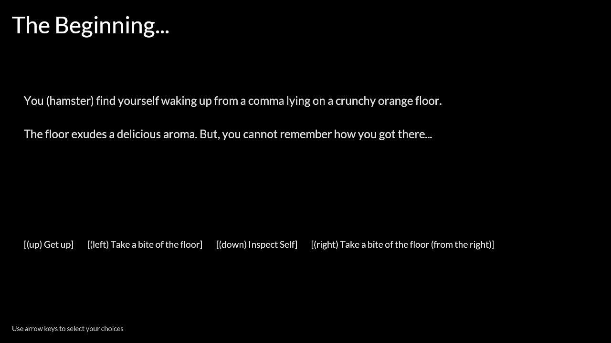

# Stuck in Heaven?

Author: Weiwen "Andy" Jiang

Design: You, the hamster wakes up from a coma and discovers that you are trapped. You have to find a way out and resist the urge to eat the walls and floor made of carrots.

Text Drawing: I stored the 128 most common characters of the font as a texture and I use the glyph spacing from free type to individually space each character. They are all rendered dynamically.

Choices: Each room is stored in its own struct and the choices (indices to the next rooms) are stored in an array since the player use the arrow keys to make the choices. For the maze and the key, I have special code that would redirect the player if the key is correct or incorrect.

Screen Shot:

How To Play:

Make sure to inspect closely if you are stuck.

Sources: https://fonts.google.com/specimen/Lato

This game was built with [NEST](NEST.md).

